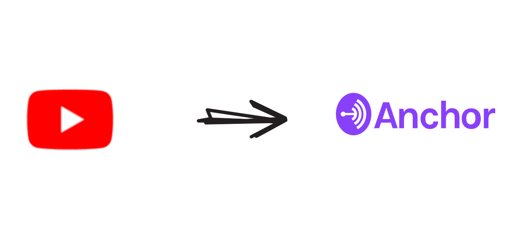

# YouTube to Anchor.fm - An automation tool to publish your podcast



This Github action will upload an audio file from a given YouTube video automatically to your Anchor.fm account.

It is very useful in a scenario where you have a YouTube account and also a podcast over Anchor.fm

NOTE: This is a reimplementation of the original [youtube-to-anchorfm](https://github.com/Schrodinger-Hat/youtube-to-anchorfm) from Schrodinger-Hat.

This reimplementation simplifies the usage of the dependencies for chromium and yt-dlp
using the npm packages ```youtube-dl-exec```, which downloads ```yt-dlp``` automatically and ```pupeteer```, which downloads chromium browser automatically. This makes it easy to run the script locally, without building a docker image or running it only as a Github action.

This reimplementation is reoganized into several modules to make the main script more readable.

## How it works

The action will start every time you push a change on the `episode.json` file. Into this file you need to specify the YouTube id of your video.

The action uses a docker image built over Ubuntu. It takes some time to setup the environment before runnign the script.

**NOTE**: in order for the script to run its necessary for there to be at least one episode already published on anchorFM manually, because on a brand new anchor fm account the steps to publish are bit different, it asks questions about the channel.

## How can I use this as a Github action?

In your repository root directory you should add a `episode.json` file containing your YouTube video id, e.g:
```json
{
  "id": "nHCXZC2InAA"
}
```

Then you can add under the `.github/workflows` directory this yml:

```yaml
name: 'Upload Episode from YouTube To Anchor.Fm'

on:
  push:
    paths: 
      - episode.json
    branches: [main]

jobs:
  upload_episode:
    runs-on: ubuntu-latest
    steps:
      - uses: actions/checkout@v2
      - name: Upload Episode from YouTube To Anchor.Fm
        uses: matevskial/youtube-to-anchorfm-2@master
        env:
          ANCHOR_EMAIL: ${{ secrets.ANCHOR_EMAIL }}
          ANCHOR_PASSWORD: ${{ secrets.ANCHOR_PASSWORD }}
          EPISODE_PATH: /github/workspace
```

**NOTE**: you need to [set up the secrets](https://docs.github.com/en/free-pro-team@latest/actions/reference/encrypted-secrets#creating-encrypted-secrets-for-a-repository) for *ANCHOR_EMAIL* and *ANCHOR_PASSWORD*. This environment variables are mandatory as they specify the sign in account.

## How can I setup for development and use the script locally?

To run the script locally, you need ```python3``` and ```ffmpeg``` to be avaliable in ```PATH``` which are used by the npm dependency ```youtube-dl-exec```.

Clone the repository and do ```npm ci``` to install the exact dependencies that are specified in ```package-lock.json```.

After that, you can edit ```episode.json``` that is located at the root of this repository.
It is recommended to specify the id of a short youtube video in ```episode.json``` for testing.

Then, make sure to setup your ```.env``` file in the root of this repository so you can put
the environment variables that you normaly specify in the Github action YAML file.

To do that, you can copy ```.env.sample``` into a file with name ```.env```.

Make sure to specify the mandatory environment variables for logging in to Anchorfm,
 ```ANCHOR_EMAIL``` and ```ANCHOR_PASSWORD```.

Finally, you can do ```npm start``` to execute the script.

## How to upload a YouTube playlist to Anchorfm using this script?

Currently, you can process a full playlist (one way only) with

```
curl https://scc-youtube.vercel.app/playlist-items/PLoXdlLuaGN8ShASxcE2A4YuSto3AblDmX \
    | jq '.[].contentDetails.videoId' -r \
    | tac \
    | xargs -I% bash -c "jo id='%' > episode.json && git commit -am % && git push"
```

`https://scc-youtube.vercel.app/playlist-items` is from https://github.com/ThatGuySam/youtube-json-server

`jo` is a json generator https://github.com/jpmens/jo

`tac` is a command present in most linux distributions and on mac with brew install coreutils. Its from reversing the list from older to newer. Remove if you want to upload in the order presented on YouTube.

`jq` is a json processor https://stedolan.github.io/jq/

This must be run on the folder where your episode.json is.

## Environment variables

### Draft Mode

By setting the `SAVE_AS_DRAFT`, the new episode will be published as a draft. This can be useful if you need someone else's
approval before actual publication.

```yaml
env:
   SAVE_AS_DRAFT: true
```

### Audio conversion options

ffmpeg is used to convert the video to MP3. It's possible to pass arguments to ffmpeg with `POSTPROCESSOR_ARGS` environment
variable.

See `-postprocessor-args` syntax and options on https://github.com/yt-dlp/yt-dlp#post-processing-options.

The example below convert the video to mono audio.

```yaml
env:
   POSTPROCESSOR_ARGS: "ffmpeg:-ac 1"
```

### Explicit Mode

By setting the `IS_EXPLICIT`, the new episode will be marked as explicit.
```yaml
env:
   IS_EXPLICIT: true
```

### Thumbnail Mode

By setting the `LOAD_THUMBNAIL`, the new episode will include the video thumbnail as the episode art.
```yaml
env:
   LOAD_THUMBNAIL: true
```

### Add YouTube URL to Podcast Description

By setting the `URL_IN_DESCRIPTION`, the Podcast description will include the YouTube URL on a new line at the end of the description.
It is recommended to set it, for if the YouTube video has no description it will fail to save the new episode. Setting it to true guarantees to always have a description.

```yaml
env:
   URL_IN_DESCRIPTION: true
```

# Credits

[@thejoin](https://github.com/thejoin95)

[@wabri](https://github.com/wabri)

[@matevskial](https://github.com/matevskial)

# License

MIT